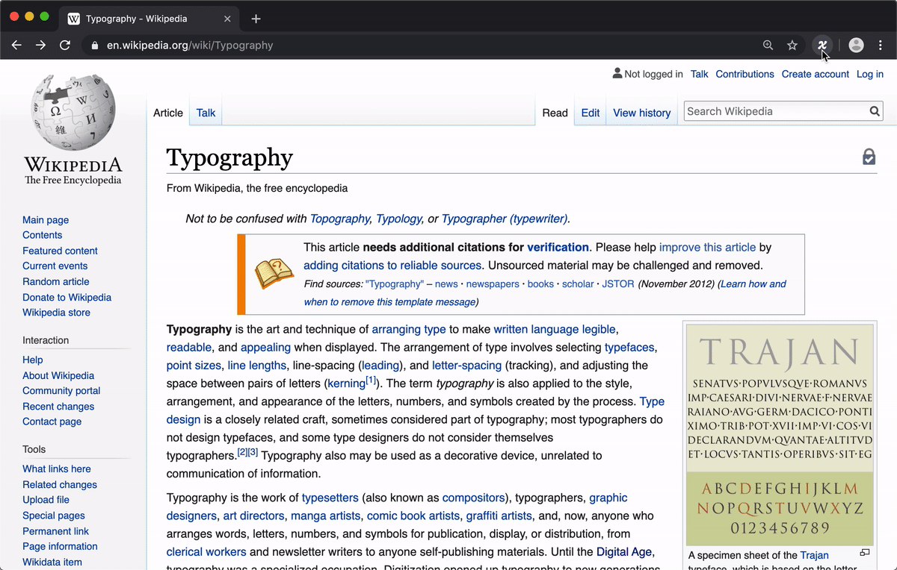

<p align="center">
    
</p>
<h1 align="center">
  Type-X: test your fonts across the web!
</h1>

Type-X is a Google Chrome extension that makes it easy and efficient to test local fonts on any website.

- Browse comfortably to experience your own fonts in context, with blazing-fast font injection and a one-click override.
- Use your local fonts or add custom font files directly to test real web font files – WOFF & WOFF2 included (all fonts stay on your computer).
- Take full control over how you apply your fonts with custom CSS selectors and styles.
- Avoid "tofu" from icon fonts with preset and custom selectors to ignore icon elements.



## Why?

Type designers spend countless hours creating type proofs and fake designs to test their fonts. This is a vital part of the type design process, but sometimes the best way to understand how a font works (and what needs fixing) is to experience it as a reader, not as a designer.

Likewise, web designers & developers spend a lot of time guessing what different fonts might look like in their apps, but testing actual fonts in context requires someone to either dig into the CSS or to mess with clunky CSS-override browser extensions.

Additionally, almost *anyone* may have reasons they want to easily override fonts on the web. Maybe they are trying out a new typeface and want to get an idea of what it feels like to look at, read, and use. Maybe they just prefer to browse the news in a particular font.

Whatever reason you want to override fonts, Type-X makes it fast, easy, and fun. Just visit any webpage, then hit a button to swap fonts! Open the extension’s settings panel to try different fonts from your collection, just like you would in a desktop app. Need to tweak the styles to make it work just-so? Customize the selectors you target and the CSS styles you apply, all within the extension.

## Installation

Find the Type-X extension in the [Chrome web store](https://chrome.google.com/webstore/category/extensions). (A direct link will be added once it's released.)

### Install in Developer Mode

If you wish to develop or edit the extension itself, you can clone this repo and use it in Chrome:

1. Git Clone the repo
2. Run `yarn` to set up dependencies, then `yarn build` to build
3. Extension will be saved in the `dist` folder
4. Go to chrome://extensions/ in Chrome
5. Turn on "Developer Mode"
6. Click "Load unpacked"
7. Navigate to the `dist` folder of the repo you cloned

## Usage

### Basics

Click the switch to activate font overrides! Click it again to remove your overrides.

Click the menu icon (`☰`) to control your font overrides.

### Font Overrides

Type-X can have one or more font overrides at a given time, and these overrides are applied to all web pages you visit with Type-X activated.

To add a new override, click the `+` button. 

To customize an override, click the `›` icon to expand it.

To remove an override, expand one of the font overrides and click `Delete`. Note: deleting an override does not delete the font file, even if you have loaded the font file directly into the extension.

#### Apply edits (visible after any change)

If you have made a change to a font override, this button will appear in the top bar. Click it to apply your changes.

#### Font menu

Select any font that is local to your computer, or any font that you have loaded into the extension.

#### Loading fonts

If you wish to load a specific font file (e.g. to test `coolfont-italic.woff2`), click the `load` icon next to the font menu.

Note: if you have loaded *a lot* of fonts, it is possible you may eventually hit a slowdown. In this case, see Installation instructions above to install this in Developer Mode.

#### Using variable fonts

Type-X can't parse local variable fonts. To use use a variable font and have Type-X automatically detect axes to provide sliders, you must load the font file as specified above.

Note: the sliders are shown to assist you in selecting your preferred axis location. For performance reasons, Type-X doesn't currently have a live-reloading form, meaning that you must click "Apply Edits" to make your axis-slider changes take effect.

If you prefer writing CSS to using the axis sliders (for instance, in order to specify exact axis values), you can alternatively do this with `font-variation-settings`, like so:

```
font-variation-settings: "wght" 550, "slnt" -9;
```

#### `Elements`: Targeting specific items to style

If you are adding font overrides, you may want to override specific parts of the web in specific ways. By default, Type-X styles all "code" elements in a monospaced font, and everything else in a proportional (natural-width) font.

Maybe you want to style headings in a display font, like Papyrus. You could get pretty close by using something like the following:

```
h1, h1 *, h2, h2 *, h3, h3 *
```

Maybe you want to target all links on a page. You could probably get close with selectors like this:

```
a, button
```

Using CSS selectors requires some knowledge of HTML and CSS, but you can do a lot by knowing just a few basics. Mozilla writes excellent guides to web technology, and if you'd like to learn more about selectors, take a look at their article [Introduction to CSS: Simple Selectors](https://developer.mozilla.org/en-US/docs/Learn/CSS/Introduction_to_CSS/Simple_selectors). Often, you may need to inspect an element to know how to target it with a CSS Selector. For this, Chrome's _Inspect_ tool is very useful – [here's an introduction to inspecting elements in Chrome](https://developers.google.com/web/tools/chrome-devtools/dom/).

#### `CSS styles`: Controlling styles of targeted items

You may want to control styles such as weight, size, or color in overridden text. If so, you can use CSS style properties to do so. For instance, if you want to make all text affected by a certain font override into bold, 20px, black text, you could use this style:

```
font-weight: bold;
font-size: 20px;
color: black;
```

Of course, using fewer style overrides is often better, so that you see your chosen font while disrupting a web page's styles as little as possible.

#### `Selectors to ignore`

This field is primarly here to help you avoid override elements which rely on icon fonts, as this can result in "tofu" – empty rectangles where a particular font doesn't support a certain glyph.

Several common or notable situations are already ignored with the pre-supplied selector list. If you come across other icon tofu, you can use this field to ignore certain elements, so you can continue happily browsing with overrides intact.

Currently, selectors in this list must be direct (not combined) selectors. That is, you can use `.icon` to ignore any element with the class of `icon`, but not `.icon a`, `#menu li > span`, `buttons *`, etc.

## Contributing

Have you found selectors of icon fonts that might be worth adding to the preset "ignore" list?

Did you get stuck on something?

Have you found a bug?

Let us know! [File an issue](https://github.com/kabisa/recursive-extension/issues) or make a pull request (please see [Contributing guidelines](CONTRIBUTING.md)).
