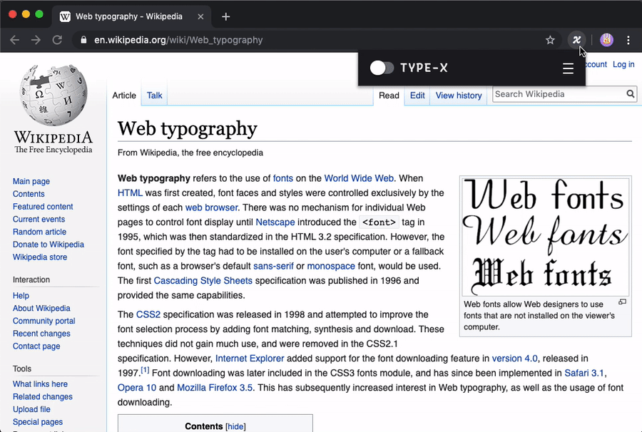

<p align="center">
    
</p>
<h1 align="center">
  Type-X: test your fonts across the web!
</h1>

<h3 align="center"><a href="https://chromewebstore.google.com/detail/type-x/paelebbajjhdmomglaffoachiepobeag" target="_blank">Now on the Chrome Web Store ↗</a></h3>


---

Type-X is a Google Chrome extension that makes it easy and efficient to test local fonts on any website.

- Browse comfortably to experience your own fonts in context, with blazing-fast font injection and a one-click override.
- Use your local fonts or add custom font files directly to test real web font files – WOFF2 included. (All fonts stay on your own computer, and nothing is uploaded to any server, etc).
- Test variable fonts, inheriting multiple existing weights and styles from a website, to preview how the weights of that font behave.
- Take full control over how you apply your fonts with custom CSS selectors and styles.
- Avoid "tofu" from icon fonts with preset and custom selectors to ignore icon elements.



## Your data stays your own

Type-X doesn’t require any kind of user account. There are no trackers, and it collects no data, even for analytics. No ads will ever be added. Your fonts stay on your computer, cached in your local browser. 

Type-X began as an experimental project by [ArrowType](https://arrowtype.com/), and it continues to receive their time and effort, because it is such a helpful a tool for testing and improving font projects. Much of the development was enabled by generous financial support from the [Google Fonts](https://fonts.google.com/) team, because it is used to develop fonts commissioned by Google.

Ultimately, this is a tool made by type designers and developers who wanted a good tool to test fonts on the web. It is shared freely because we have collaborators and colleagues who also find it useful.

## Why?

Type designers spend countless hours creating type proofs and fake designs to test their fonts. This is a vital part of the type design process, but sometimes the best way to understand how a font works (and what needs fixing) is to experience it as a reader, not as a designer.

Likewise, web designers & developers spend a lot of time guessing what different fonts might look like in their apps, but testing actual fonts in context requires someone to either dig into the CSS or to mess with clunky CSS-override browser extensions.

Additionally, almost *anyone* may have reasons they want to easily override fonts on the web. Maybe they are trying out a new typeface and want to get an idea of what it feels like to look at, read, and use. Maybe they just prefer to browse the news in a particular font.

Whatever reason you want to override fonts, Type-X makes it fast, easy, and fun. Just visit any webpage, then hit a button to swap fonts! Open the extension’s settings panel to try different fonts from your collection, just like you would in a desktop app. Need to tweak the styles to make it work just-so? Customize the selectors you target and the CSS styles you apply, all within the extension.

## Installation

Type-X is currently unlisted from the Chrome Web Store for maintenance. However, it can still be used in Chrome Developer Mode.

### Install in Developer Mode

If you wish to develop or edit the extension itself, you can directly download the latest build, and use it in Chrome:

1. Download the zip file from [the latest release](https://github.com/arrowtype/type-x/releases/latest).
2. Go to chrome://extensions/ in Chrome
3. Turn on "Developer Mode"
4. Drag-n-drop the downloaded zip onto the extensions page.

## Development

If you wish to work on the code of Type-X, follow these steps, then install in developer mode (see above).

1. Git Clone the repo
2. Run `npm i` to set up dependencies, then `npm run build` to build
3. The extension will be saved in the `dist` folder

## How to use Type-X

### Basics

Click the switch to activate font overrides! Click it again to remove your overrides.

### Font Overrides

Type-X can have one or more font overrides at a given time, and these overrides are applied to all web pages you visit with Type-X activated. (Some websites block the injected CSS used to apply the fonts, but most allow it! If the extension isn’t working on a particular website, this is probably the reason.)

To add a new override, click the `+ Add font` button. 

To customize an override, click the `›` icon to expand it.

To remove an override, expand it and click `Delete`. 

Note: deleting an override does not delete the font file from the Type-X menu, even if you have loaded the font file directly into the extension. It will still be available as an option, unless you reset the entire extension.

#### Font menu

Select any font that is local to your computer, or any font that you have loaded into the extension.

#### Loading fonts

If you wish to load a specific font file (e.g. to test `coolfont-italic.woff2`), click the `load` icon next to the font menu.

Note: if you have loaded *a lot* of fonts, it is possible you may eventually hit a slowdown. In this case, see Installation instructions above to install this in Developer Mode.

#### Using variable fonts

Type-X can't parse local variable fonts. To use use a variable font and have Type-X automatically detect axes to provide sliders, you must load the font file as specified above.

Hint: When you load in a variable font with a weight axis, you can select the font style option “[Inherit page styles]” to pick up styles such as weight from a page. This is a really handy way to test your weights!

Note: the sliders are shown to assist you in selecting your preferred axis location. For performance reasons, Type-X doesn't currently have a live-reloading form, meaning that you must click "Apply Edits" to make your axis-slider changes take effect.

If you prefer writing CSS to using the axis sliders (for instance, in order to specify exact axis values), you can alternatively do this with `font-variation-settings`, like so:

```
font-variation-settings: "wght" 550, "slnt" -9;
```

#### `Elements`: Targeting specific items to style

If you are adding font overrides, you may want to override specific parts of the web in specific ways. By default, Type-X styles all "code" elements in a monospaced font, and everything else in a proportional (natural-width) font.

Maybe you want to style headings in a display font, like Papyrus. You could get pretty close by using something like the following:

```
h1, h1 *, h2, h2 *, h3, h3 *
```

Maybe you want to target all links on a page. You could probably get close with selectors like this:

```
a, button
```

Using CSS selectors requires some knowledge of HTML and CSS, but you can do a lot by knowing just a few basics. Mozilla writes excellent guides to web technology, and if you'd like to learn more about selectors, take a look at their article [Introduction to CSS: Simple Selectors](https://developer.mozilla.org/en-US/docs/Learn/CSS/Introduction_to_CSS/Simple_selectors). Often, you may need to inspect an element to know how to target it with a CSS Selector. For this, Chrome's _Inspect_ tool is very useful – [here's an introduction to inspecting elements in Chrome](https://developers.google.com/web/tools/chrome-devtools/dom/).

#### `CSS styles`: Controlling styles of targeted items

You may want to control styles such as weight, size, or color in overridden text. If so, you can use CSS style properties to do so. For instance, if you want to make all text affected by a certain font override into bold, 20px, black text, you could use this style:

```
letter-spacing: 0; /* resets style */
font-weight: bold;
font-size: 20px;
color: black;
```

Of course, using fewer style overrides is often better, so that you can see your chosen font while disrupting a web page's overall styles and layout as little as possible.

#### `Selectors to ignore`

This field is primarly here to help you avoid override elements which rely on icon fonts, as this can result in "tofu" – empty rectangles where a particular font doesn't support a certain glyph.

Several common or notable situations are already ignored with the pre-supplied selector list. If you come across other icon tofu, you can use this field to ignore certain elements, so you can continue happily browsing with overrides intact.

Currently, selectors in this list must be direct (not combined) selectors. That is, you can use `.icon` to ignore any element with the class of `icon`, but not `.icon a`, `#menu li > span`, `buttons *`, etc.

## Contributing

Have you found selectors of icon fonts that might be worth adding to the preset "ignore" list?

Did you get stuck on something?

Have you found a bug?

Let us know! [File an issue](https://github.com/arrowtype/type-x/issues) or make a pull request (please see [Contributing guidelines](CONTRIBUTING.md)).

## Credits (October 2025)

Many thanks to:
- @simoncozens for all his recent work to rewrite and revive the extension.
- [Google Fonts](https://fonts.google.com/) for financially supporting Simon’s recent work here, along with financially supporting much of the original design & development.
- @RoelN for making a few recent UX upgrades, as well as for his original role in developing and co-designing the original version of the extension.
- @arrowtype (that’s me!) for the coordinating the recent development work, as well as leading the original design and development.
- Everyone who expressed support of the extension. We couldn’t have revived this without you!
